# GitHr

[](https://github.com/mhrezaee/git-hr/actions/workflows/ci.yml)
[](https://dotnet.microsoft.com/)
[](https://avaloniaui.net/)


[](LICENSE)

A fast, free, cross-platform Git GUI built with C#, .NET 10 and Avalonia UI.
Windows first; macOS and Linux run from the same code. No accounts, no paywall, no repository limits — public and private repositories alike.

- [Features](#features)
- [Architecture](#architecture)
- [Design decisions](#design-decisions)
- [Key flows](#key-flows)
- [Testing strategy](#testing-strategy)
- [Continuous integration](#continuous-integration)
- [Security and privacy](#security-and-privacy)
- [Getting started](#getting-started)
- [Project structure](#project-structure)
- [Roadmap](#roadmap)

---

## Features

### Repositories
- **Clone** public or private repositories (HTTPS or SSH), with the folder name derived from the URL and a copied git URL pre-filled from the clipboard
- Open any local repository, or pass its path on the command line; recent repositories on the start screen
- **Live progress** for clone, fetch, pull and push ("Receiving objects: 45%"), with a **Cancel** button

### History
- Commit graph with colored lanes, merge nodes, and branch and tag badges
- Commit details: full message, author, date, SHA and changed files, with a diff per file
- Right-click a commit to check it out (detached), create a branch or tag there, cherry-pick, revert, reset the current branch (soft / mixed / hard), or copy its SHA or subject

### Search, file history and blame
- **Search the history** (`Ctrl+F`) across all branches and tags by **message**, **author** (name or e-mail), **code change** (commits that added or removed a piece of text — git's pickaxe) or **SHA / ref** (`a1b2c3d`, `v1.2`, `HEAD~3`). Enter searches, Esc goes back to the full graph; text is matched literally, not as a regular expression
- **File history**: right-click any file (changes, staged or in a commit) → *File history* lists every commit of the current branch that touched it, **following renames**. Selecting a commit opens that file's diff straight away, under the name it had then
- **Blame**: who last changed each line, with commit, author, date and summary once per block, syntax colors and an age bar (newer = brighter). Blame the working tree (uncommitted lines are marked) or the file as it was in any commit
- Double-click a blamed line to jump to its commit in the history — found even when the current filter hides it

### Branches
- Local and remote branches with ahead/behind counts; double-click to check out (a remote branch becomes a local tracking branch)
- Right-click a branch to merge it into the current branch, rebase onto it, create a branch from it, rename it, or delete it (locally or on the remote)

### Changes
- Stage and unstage whole files, **single hunks, or selected lines** (Ctrl/Shift+click lines in the diff)
- Discard changes per hunk, per selected line, per file, or all at once
- Commit with Ctrl+Enter, or **amend the last commit** (message pre-filled; warns if it was already pushed)

### Diff viewer
- **Syntax highlighting** for C#, XAML/XML, JSON, TypeScript/JavaScript, Python, Markdown, YAML, shell and every other language with a TextMate grammar (the same grammars VS Code uses), in the Dark+ theme
- **Changed words stand out**: in a replaced line, the part that actually changed gets a stronger background
- **Unified or side by side** (old version left, new version right, replacements on the same row): toggle with **Side by side** or from the command palette; the choice is remembered
- Staging, unstaging and discarding hunks and selected lines work in both layouts — in side by side, selecting a row selects its removed and its added line
- The same viewer for working-tree, staged, commit and stash diffs, with old/new line numbers

### Stashes and tags
- **Stash list** in the sidebar with message, branch and date; stash with a message (untracked files included)
- Click a stash to see its files — including stashed untracked files — and their diffs; **apply** (keep), **pop** (apply and remove) or **drop** any stash, not just the latest
- **Tags** in the sidebar (newest first): click one to jump to its commit; check it out, create a branch from it, push it, delete it locally or on the remote
- Create lightweight or **annotated** tags (with a message) from any commit or at HEAD; push all tags at once

### Remotes
- Fetch (all remotes, prune deleted branches), pull and push; the first push of a new branch publishes it and sets its upstream
- **Force push with lease** after amending or rebasing — refuses to overwrite commits someone else pushed

### Conflicts
- When a merge, rebase, cherry-pick or revert stops on conflicts, a banner offers **Resolve…**, **Continue** and **Abort**
- **Conflict resolver**: double-click a conflicted file (`!`) to see every conflict with *ours* and *theirs* side by side and a few lines of context; choose ours, theirs or both (in either order) per conflict or for all, and edit the live result directly
- Sides are labelled with what they mean for the current operation — including the rebase case, where "ours" and "theirs" are swapped
- Save is only possible once no conflict markers are left; manual edits are never overwritten without asking
- Whole-file choices from the right-click menu (take ours / take theirs / mark as resolved), which also handle binary files and delete-vs-modify conflicts
- Line endings and UTF-8 BOMs are preserved; git's `diff3` conflict style (with the common ancestor) is understood

### Productivity
- **Command palette** (`Ctrl+P`): fuzzy search over all commands, check out any branch, open recent repositories, or type a new name to create a branch
- Refreshes automatically when the window regains focus

---

## Architecture

GitHr is split into a UI-independent **Core** and an Avalonia **App**. Core knows nothing about the UI and can be reused by a CLI, tests or another front end. Every Git operation goes through the real `git` executable.

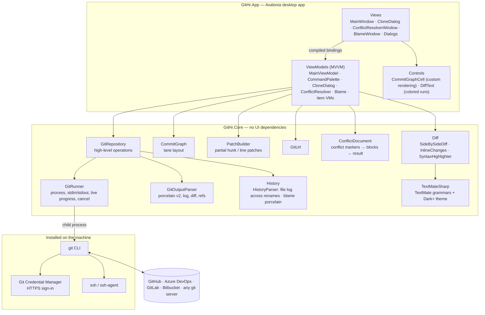

### Layers and responsibilities

| Layer | Responsibility | Must not |
|---|---|---|
| **Views** (`*.axaml`, code-behind) | Layout, styling, input routing, native dialogs (folder picker, clipboard) | Contain Git logic or state |
| **ViewModels** | UI state, commands, confirmation rules, busy/progress/cancel handling, selection | Start processes or parse Git output |
| **Core: `GitRepository`** | One method per Git operation, typed results, error translation (`GitException`) | Know about windows, threads or dialogs |
| **Core: `GitRunner`** | Run `git` safely: argument lists (no shell quoting), UTF-8, no terminal prompts, streamed progress, kill on cancel | Interpret results |
| **Core: pure algorithms** | `GitOutputParser`, `CommitGraph`, `PatchBuilder`, `ConflictDocument`, `GitUrl`, `SideBySideDiff`, `InlineChanges`, `SyntaxHighlighter`, `HistoryParser` — deterministic functions over text | Perform I/O |

### Threading model

- The UI thread only updates view models. Git runs in child processes awaited asynchronously, so the window never freezes.
- Commit graph layout for thousands of commits runs on the thread pool (`Task.Run`), then results are applied on the UI thread.
- Syntax highlighting of a diff runs on the thread pool too, within a time budget; a newer file selection cancels an older one, so fast clicking never shows a stale diff.
- User actions wait for a running background refresh instead of being dropped (closing a confirmation dialog re-activates the window, which refreshes).
- The blame window is non-modal: it stays open next to the main window, and "show commit" drives the main window's history.
- Live progress is read from git's stderr as it arrives and marshalled to the UI thread via `Progress<T>` (which captures the UI synchronization context).
- Every long operation has a `CancellationToken`; cancelling kills the whole git process tree and, for clones, removes the half-written folder.

---

## Design decisions

| Decision | Why | Trade-off |
|---|---|---|
| **Drive the `git` CLI instead of a library (libgit2)** | 100% compatible with the user's git: credential helpers, SSH agents, hooks, LFS, `includeIf`, signing. Private repositories need no extra auth code. | Process start per command (milliseconds); output must be parsed |
| **Machine-readable output only** (`status --porcelain=v2 -z`, custom `log --format` with control-character separators, `for-each-ref` formats) | Stable across git versions and user locales; file names with spaces or Unicode are safe | Parsers are hand-written — and therefore unit-tested |
| **`GIT_TERMINAL_PROMPT=0`, `GIT_EDITOR=true`, stdin closed** | A GUI has no terminal: git must never block waiting for input or an editor. GUI credential helpers still show their sign-in windows. | Features that need an editor (interactive rebase) get their own UI |
| **Conflicts resolved from the working-tree markers, then `git add`** | Works with every git conflict style (incl. `diff3`/`zdiff3`) and any merge strategy; the result is exactly what git expects, and editing the file elsewhere keeps working | Marker parsing must be robust — malformed markers are treated as text, and `ConflictDocument` has 98% line coverage |
| **Partial staging via generated patches + `git apply --cached`** | Exactly the same result as command-line git; works for index and working tree, forward and reverse | Patch building needs care when removed/added lines interleave — covered by dedicated tests |
| **Syntax highlighting with TextMate grammars (TextMateSharp)** | The grammars and theme VS Code uses: dozens of languages with no per-language code, pure .NET so it stays in Core and is unit-tested | Grammars are regex-based — the old and new side are tokenized as separate streams, each hunk starts fresh, and a per-diff time budget keeps huge diffs fast (they stay uncolored beyond it) |
| **Side by side is a view over the same parsed diff** | Rows only pair up line indexes of the unified diff, so hunk and line staging reuse `PatchBuilder` unchanged and both layouts always agree | A selected row stages its removed and added line together; to stage just one of them, select it in the unified layout |
| **Changed words from common prefix/suffix, widened to whole words** | Cheap (linear per line pair) and exactly right for the common case of a changed identifier, literal or argument | Several separate edits in one line are shown as one changed range |
| **A history filter replaces the query, not the list** | Search and file history are `git log` calls (`--grep`, `--author`, `-S`, `--follow`) that run on every refresh, so after a commit, fetch or checkout the filtered list is still correct; searching uses all of git's history, not just what was loaded | Each refresh re-runs the query; pickaxe (`-S`) searches are slower on very large repositories |
| **File history reads the path per commit** (`log --follow --name-status -z`) | A renamed file is followed, and each commit's diff is opened under the name the file had then; `-z` keeps paths with spaces or quotes intact | `--follow` works on one file and along the current branch only — which is what "history of this file" means |
| **Filtered history is drawn as one straight line** | Search results skip commits, so real parent links would dangle across the graph; only the drawing is linearized — each commit keeps its real parents for diffs | Merge structure is not shown while filtering ("Show all commits" brings the graph back) |
| **Blame from `git blame --porcelain`** | Exact attribution including uncommitted lines and renames; commit details are parsed once per commit and shared by all its lines | Blaming very large files takes as long as git does |
| **Avalonia UI** | One codebase for Windows, macOS and Linux; Skia rendering looks identical everywhere; a real headless mode for UI tests | Smaller ecosystem than web UI stacks |
| **MVVM with CommunityToolkit.Mvvm source generators** | Testable view models, no reflection-heavy frameworks, compile-time checked bindings | Some boilerplate in item view models (`Owner` references for context menus) |
| **Destructive actions always confirm; Enter never confirms them** | Discard, reset hard, force delete and force push cannot be undone | One extra click |
| **`--force-with-lease` instead of `--force`** | Never silently overwrites commits pushed by someone else | Rejects when the remote-tracking ref is stale (fetch first) |

---

## Key flows

### Staging selected lines

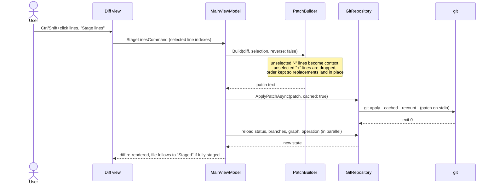

### Showing a diff

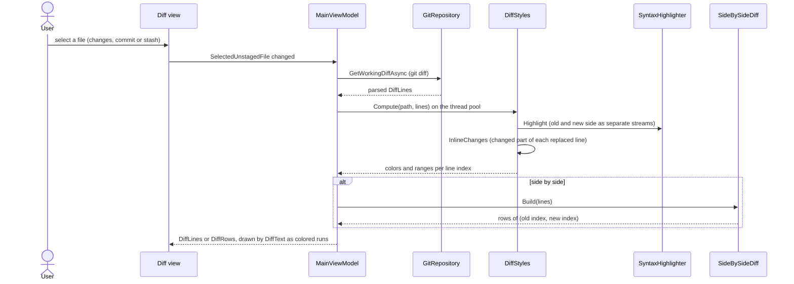

### Finding who changed a line

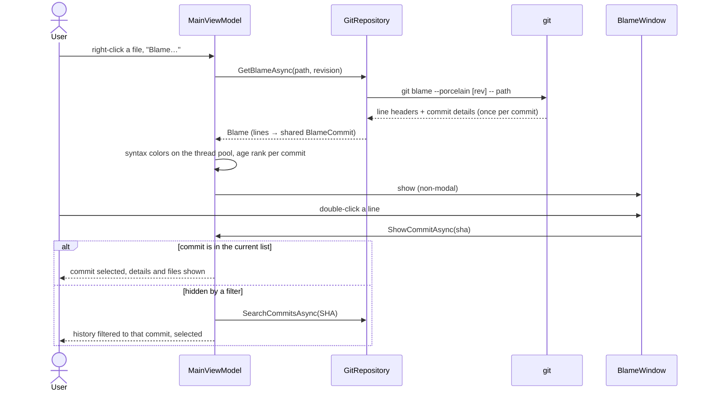

### Cloning a private repository

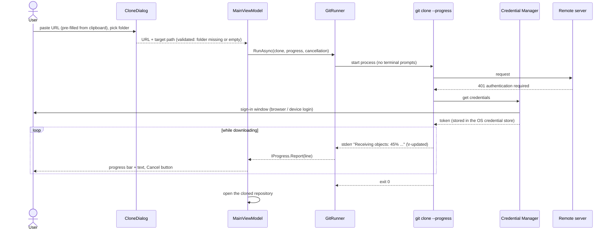

### Merge / rebase / cherry-pick / revert with conflicts

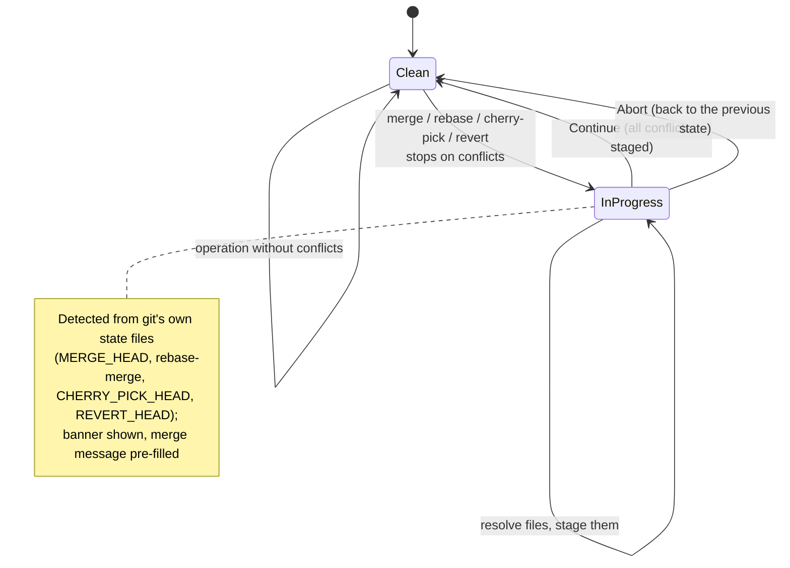

### Resolving a conflicted file

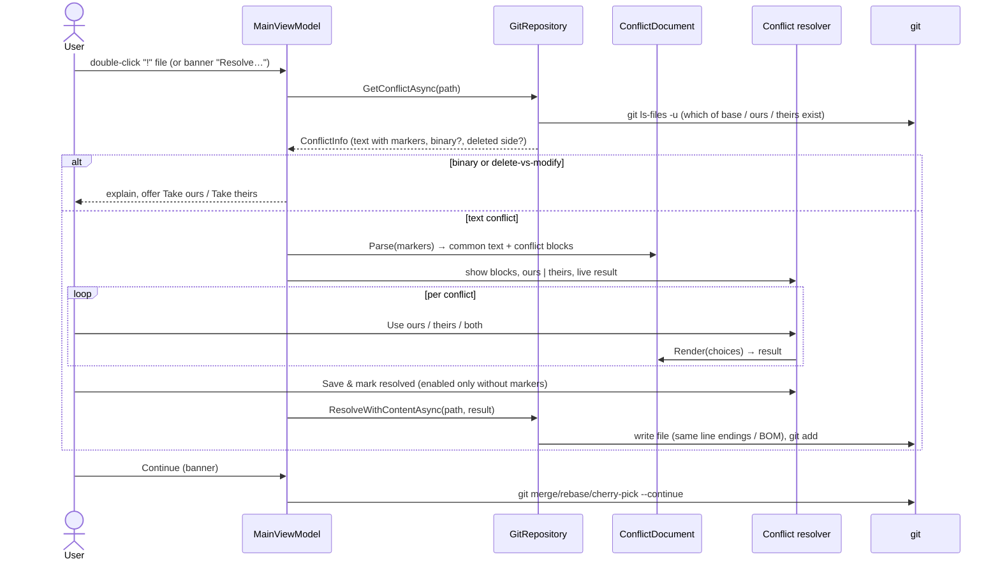

### Stash lifecycle

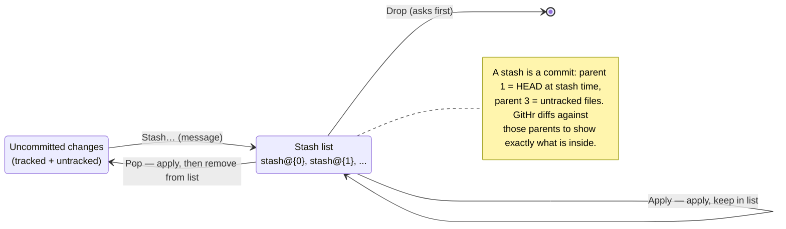

### Commit graph layout

`CommitGraph.Layout` assigns each commit (in `git log --date-order`) to a vertical lane in a single pass. Each lane remembers which commit it is heading to. A commit takes the lane that points to it (or the first free one); its first parent continues straight down the same lane, other parents open or join lanes; lanes that meet at a commit merge into it. The renderer (`CommitGraphCell`) then draws straight lines and S-curves per row — O(commits × lanes), fast enough for thousands of commits.

---

## Testing strategy

**165 automated tests**, run with `dotnet test`. Every test uses real git against throwaway repositories — nothing is mocked at the Git boundary. **GitHr.Core has 92.4% line and 84.5% branch coverage.**

The suites use **xUnit v4** on **Microsoft.Testing.Platform** (the .NET 10 test runner, enabled for the repo in `global.json`). Test projects are self-hosting executables, so they also run directly (`tests/GitHr.Core.Tests/bin/Debug/net10.0/GitHr.Core.Tests.exe`).

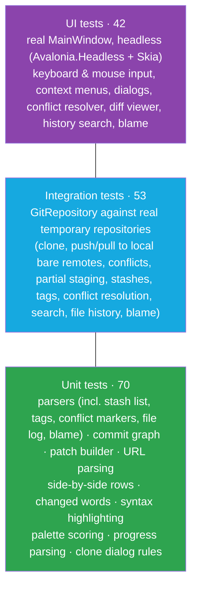

| Suite | Project | What it proves |
|---|---|---|
| Parser, graph, patch and URL unit tests | `tests/GitHr.Core.Tests` | Porcelain/log/diff parsing, lane assignment, patch generation incl. CRLF and interleaved changes, URL → folder name |
| Git integration tests | `tests/GitHr.Core.Tests` | Every repository operation end to end: staging hunks/lines, discard, branches, merge/rebase conflicts with continue/abort, cherry-pick, revert, reset, tags, clone with progress and cancel, fetch/pull/push, force-with-lease |
| Headless UI tests | `tests/GitHr.App.Tests` | Clicking the real buttons and context menus, command palette keyboard flow, clone dialog behavior, amend, conflict banner — plus rendered frames saved for visual inspection |
| View-model unit tests | `tests/GitHr.App.Tests` | Palette fuzzy scoring, progress percentage parsing, clipboard URL suggestion rules |
| Conflict tests | both | Marker parsing and rendering (diff3 base sections, CRLF, missing final newline, malformed markers), BOM kept exactly once, delete-vs-modify conflicts, whole-side choices, the resolver window from double-click to `merge --continue` |
| Diff viewer tests | both | Side-by-side pairing (replacements, uneven blocks, "no newline" markers), changed-word ranges, syntax colors per language and per side, the rendered runs in the real window, staging a side-by-side row and a hunk, the layout being remembered — plus screenshots of both layouts |
| History tests | both | Search by message (case-insensitive, literal), author name/e-mail, pickaxe on another branch, SHA prefixes and revisions (and rejecting options like `--all`); file history across a rename and with spaces in the path; blame per line, uncommitted lines, blame at a revision, CRLF; the search box (Ctrl+F, Enter, Esc), the filter surviving a refresh, opening the file's diff under its old name, blame → show commit (also when filtered out) — plus screenshots |
| Stash & tag tests | both | Parsing `stash list` / tags (annotated tags peeled to their commit), stashed untracked files and their diffs, apply/pop/drop by index, pushing and deleting tags on a bare remote, sidebar menus and the stash tab |

Test isolation:
- Each test creates its own repository under the temp folder and deletes it afterwards.
- UI tests use a temporary settings file, so they never touch the user's recent repositories.
- Remote scenarios use local bare repositories over `file://`, which exercises git's real transport (including progress output) without network access.
- UI tests run off-screen: input goes to the window in memory, never to the desktop.
- Every git call in the tests receives the test's cancellation token, so a cancelled or timed-out run also stops the git processes it started.

### How the UI tests run

UI tests are plain xUnit `[Fact]`s whose body runs on Avalonia's UI thread through a `HeadlessUnitTestSession` (see `tests/GitHr.App.Tests/TestAppBuilder.cs`):

```csharp
[Fact]
public Task StageHunkButton_StagesOnlyThatHunk() => RunUi(async () =>
{
    var (window, vm) = await OpenWithTwoHunksAsync();
    Click(window, FindButton(window, "Stage hunk"));
    await WaitUntilAsync(() => vm.StagedFiles.Count == 1);
    // ...
});
```

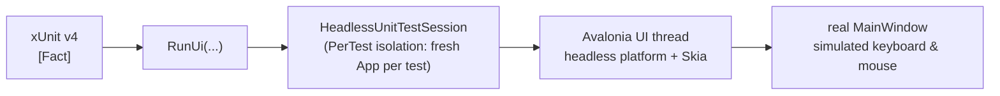

- **Why not `Avalonia.Headless.XUnit`'s `[AvaloniaFact]`?** It is compiled against xUnit v3 and breaks on v4 (`MissingMethodException` during discovery). Driving the session directly keeps the suite on the latest xUnit and independent of that adapter's release schedule.
- **Each test gets a fresh `App`** (`AvaloniaTestIsolationLevel.PerTest`), like a real application start.
- **The UI suite runs sequentially** (`[assembly: Parallelization(Mode = ParallelMode.None)]`): all UI tests share one dispatcher thread, and parallel classes would interleave their steps on it. The Core suite runs in parallel.

---

## Continuous integration

Every push and pull request to `main` runs [`.github/workflows/ci.yml`](.github/workflows/ci.yml): the same build and all test suites on **Windows, Linux and macOS**, so the cross-platform claim is checked on every change, not assumed.

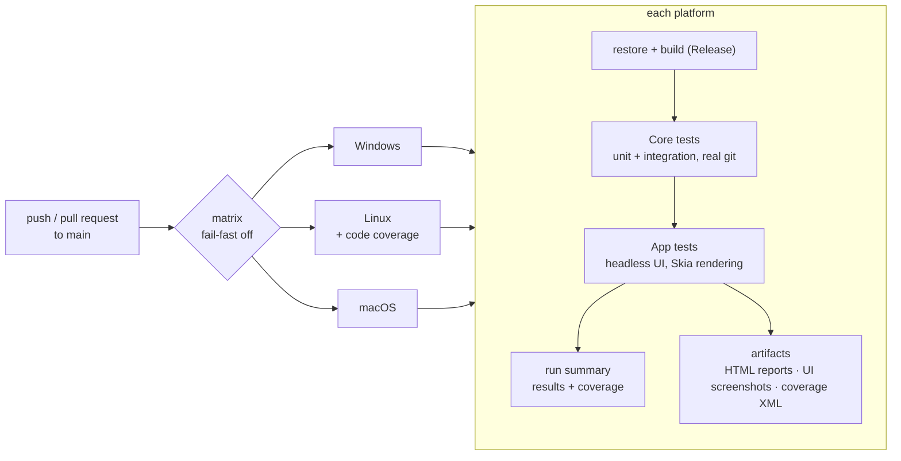

- **Fail-fast is off**, so one broken platform never hides the results of the others.
- **Artifacts per platform** (`test-results-Windows`, `-Linux`, `-macOS`): HTML test reports, the Cobertura coverage file (Linux), and the **screenshots the UI tests render** — a quick way to see how GitHr looks on each OS.
- **Run summary**: each job appends its test counts (and Linux its coverage) to the run's summary page via `.github/scripts/test-summary.sh`, written in plain POSIX shell so it runs on every runner.
- Superseded runs on the same branch are cancelled (`concurrency`), and the workflow only has read access to the repository.

## Security and privacy

- **No telemetry, no accounts, no network calls of its own.** GitHr only talks to the remotes you configure, through git.
- **Credentials never pass through GitHr.** HTTPS sign-in is handled by Git Credential Manager (credentials in the OS credential store); SSH uses your keys and agent.
- **Arguments are passed as an argument list**, never through a shell, so branch names or paths cannot inject commands.
- **Destructive operations ask first** (discard, reset hard, force delete, force push, abort), and Enter never confirms them.

---

## Getting started

Requirements: [.NET 10 SDK](https://dotnet.microsoft.com/) and Git 2.30+ on the `PATH`.

```sh
dotnet build
dotnet run --project src/GitHr.App                 # start screen
dotnet run --project src/GitHr.App -- C:\path\repo # open a repository directly
dotnet test                                        # all 165 tests
dotnet test --project tests/GitHr.App.Tests        # one suite
dotnet test --project tests/GitHr.Core.Tests --coverlet --coverlet-output-format cobertura   # coverage report in TestResults/
```

### Keyboard shortcuts

| Shortcut | Action |
|---|---|
| `Ctrl+P` / `Ctrl+Shift+P` | Command palette (`Cmd+P` on macOS) |
| `Ctrl+O` | Open repository |
| `Ctrl+Shift+O` | Clone repository |
| `F5` | Refresh |
| `Ctrl+Enter` | Commit (in the commit message box) |
| `Ctrl+F` | Search the history (Enter searches, Esc shows all commits again) |
| `Ctrl/Shift+click` | Select several lines in the diff |

---

## Project structure

```
GitHr/
├── src/
│   ├── GitHr.Core/                 # UI-independent Git layer
│   │   ├── GitRunner.cs            # runs git: args, env, streamed progress, cancellation
│   │   ├── GitRepository.cs        # all repository operations
│   │   ├── Models.cs               # Commit, Branch, FileChange, DiffLine, RepositoryStatus, ...
│   │   ├── PatchBuilder.cs         # partial hunk/line patches for git apply
│   │   ├── GitUrl.cs               # repository name from a clone URL
│   │   ├── Conflicts/              # ConflictDocument (marker parsing/rendering), ConflictInfo
│   │   ├── Diff/                   # SideBySideDiff, InlineChanges, SyntaxHighlighter (TextMateSharp)
│   │   ├── History/                # search kinds, file revisions, blame model + HistoryParser
│   │   ├── Graph/CommitGraph.cs    # commit graph lane layout
│   │   └── Parsing/GitOutputParser.cs
│   └── GitHr.App/                  # Avalonia desktop app
│       ├── Views/                  # MainWindow, CloneDialog, ConflictResolverWindow, BlameWindow, Dialogs
│       ├── ViewModels/             # MainViewModel (+ Actions, Remote, StashesAndTags, Conflicts, History partials), palette, clone dialog, conflict resolver, blame, diff lines/rows, items
│       ├── Controls/               # CommitGraphCell (graph lanes), DiffText (colored diff lines)
│       ├── AppSettings.cs          # recent repositories, clone folder, diff layout (per-user app data)
│       └── Converters.cs
├── tests/
│   ├── GitHr.Core.Tests/           # unit + integration tests against real repositories (xUnit v4)
│   └── GitHr.App.Tests/            # headless UI tests (xUnit v4 + HeadlessUnitTestSession)
├── .github/
│   ├── workflows/ci.yml            # build + all tests on Windows, Linux, macOS
│   └── scripts/test-summary.sh     # run summary: test reports + coverage
├── .gitattributes                  # line endings: LF in the repo, native on checkout, always LF for scripts
└── global.json                     # opts `dotnet test` into Microsoft.Testing.Platform
```

---

## Roadmap

- Interactive rebase (reorder, squash, reword, drop)
- Word-level diff for lines with several separate edits; ignore-whitespace option
- GitHub / Azure DevOps pull requests
- Multiple repository tabs, settings, light theme
- Packaging and releases from CI: installer (Windows), .dmg (macOS), AppImage/Flatpak (Linux)

## License

[MIT](LICENSE)
